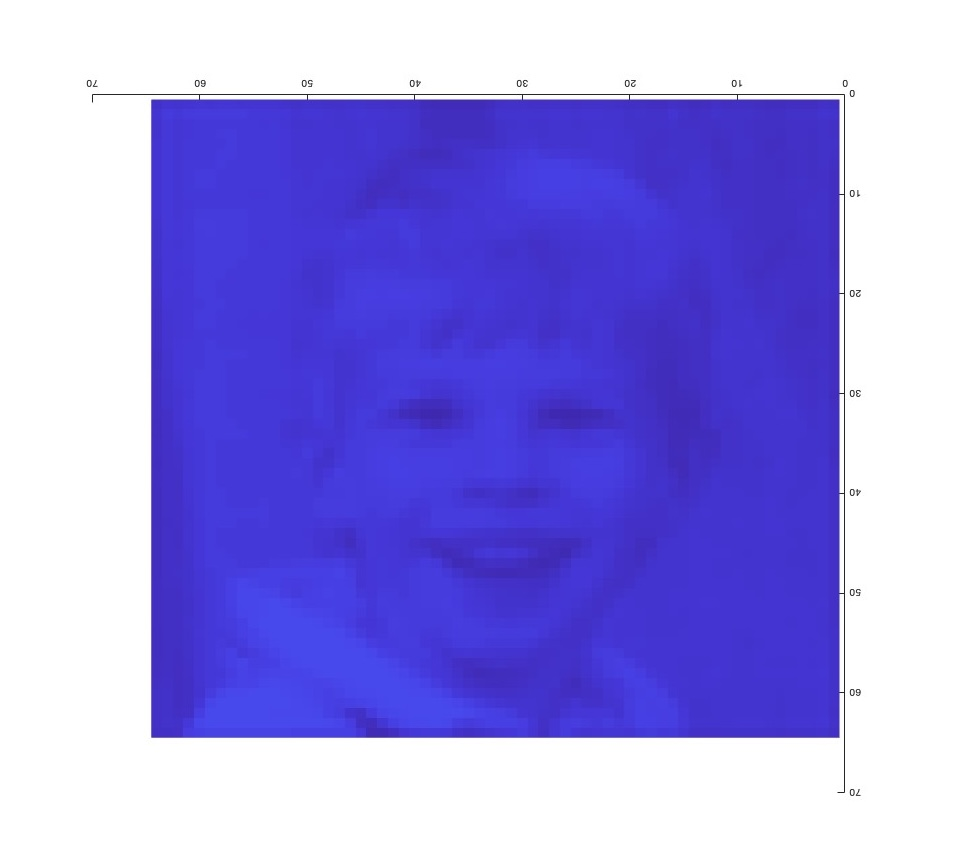
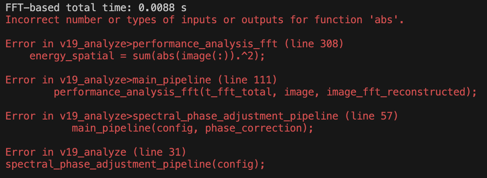
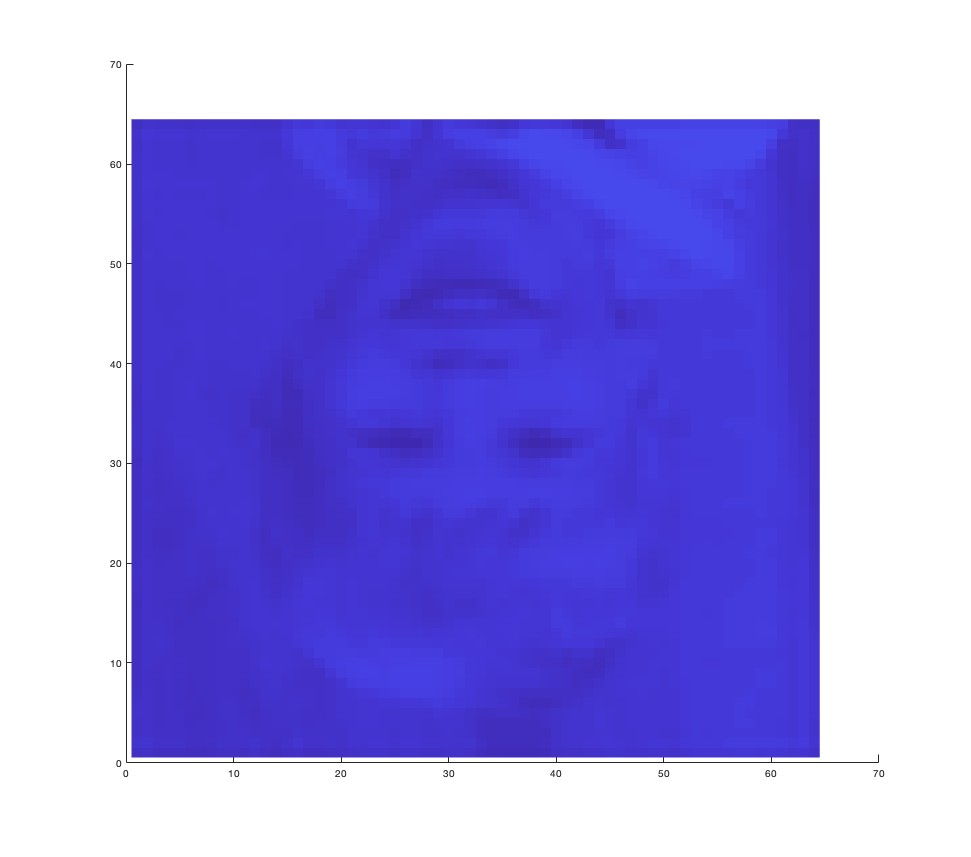

# เด็กในภาพนี้เป็นใคร? #

มาอยู่ในภาพนี้ได้ยังไง?
มีตัวตนอยู่จริง ๆ มั้ย?
หรือ... มันคืออะไร?

เมื่อเวลาเที่ยงคืนของวันที่ 30 ย่าง 31 ของเดือนตุลาคม 2025
ผมกำลังทำการทดลองการดัดแปลงคุณสมบัติทางเฟสของสเปคตรัมของภาพ
โดยแปลงภาพใน Spatial-domain ไปยัง Frequency-domain แล้วทำการบิดเบือนคุณสมบัติบางอย่างของสเปคตรัมนั้น โดยเฉพาะ Phase
จากนั้นทำการ Transform สเปคตรัมที่ถูกปรับแต่งแล้วนั้นกลับมาสู่มิติ Space-time ปกติ
โดยปกติแล้ว Output จากการปรับแต่งคุณสมบัติต่าง ๆ ในมิติอื่นที่ผ่าน ๆ มานั้นมักจะกลายเป็นภาพใหม่ไปอย่างไม่มีรูปแบบ ไม่มีรูปร่างที่ตีความได้ กล่าวคือ Entropy มันเพิ่มขึ้นอย่างมาก จนแทบไม่เหลือเค้าโครงเดิม

เปรียบเทียบให้เห็นภาพคือ เหมือนไข่ดิบตกใส่พื้นถนนแล้วโดนรถเหยียบซ้ำอีกที
ซึ่งวัตถุประสงค์ของการทดลองนี้ก็คือ “การพยายามกู้คืนซากไข่ดิบเละเทะนั้นให้กลับมาเป็นไข่ฟองเดิมอีกครั้ง”
ฟังดูเหมือนแทบจะเป็นไปไม่ได้ใช่มั้ยล่ะ แหงล่ะ
แต่มันมีแววเป็นไปได้! นี่ล่ะ ความบ้าหลุดโลกของงานวิจัยนี้ (ผมก็บ้าหลุดโลกไปไกลแล้วเหมือนกัน)

เวลาผ่านเลยมาช่วงเที่ยงคืนครึ่ง ผมกำลังทำการทดลองดังที่สรุปรวบยอดข้างต้นนั้นด้วย Factor เชิงเส้นแบบ Exponential เพื่อวิเคราะห์แนวโน้มของค่าบางค่าสำหรับบางคุณสมบัติ ว่ามีความสัมพันธ์กันอย่างไร
แน่นอนว่าการเขียนโปรแกรมและการรันแต่ละครั้งมันอาจจะมี Error เกิดขึ้นและ Halt โปรแกรมไปโดยปริยาย โดยเฉพาะภาษาที่เป็น Interpreter เช่น Python และ MATLAB ที่ผมใช้ Implement งานนี้ และมันจะค้าง Output หรือ Visualization ใด ๆ ก็ตามไว้แบบนั้นดื้อ ๆ เลย

แต่ประเด็นคือ Error ครั้งนี้ มันดันไม่เหมือน Error ครั้งไหน ๆ ที่ผมเคยเจอมาทั้งชีวิต!

ถึงแม้ Console output จะแจ้ง Error ธรรมดา ๆ ว่าจำนวนหรือรูปแบบของ Input หรือ Output สำหรับฟังก์ชัน Absolute มันไม่ถูกต้อง แต่ Visualization ที่มัน Render ตามมานั้นทำให้ผมต้องขนลุก!

มันดูเหมือนจะเป็นรูปกลับหัวของเด็กชายคนนึงกำลังยิ้ม เหมือนในภาพที่คุณกำลังเห็นอยู่นี่แหละครับ (ตีลังกากลับหัวแบบนี้เลย)

ผมตกใจและตกตะลึงไปชั่วขณะ เนื่องจากในสมองของผมมันกำลังหาทฤษฏีและสมการต่าง ๆ มาอธิบายปรากฎการณ์นี้แบบฉับพลัน ผมเริ่มมึนหัวหน่อย ๆ เพราะดูเหมือนว่าสมองผมมันจะยังไม่สามารถหาคำอธิบายใด ๆ มานิยามมันได้ในช่วงเวลาไม่กี่วินาทีนี้

ความรู้สึกเหมือนนั่งอยู่ในรถของตัวเองที่คิดว่าจอดนิ่งสนิทในลานจอดรถ แต่เท้าขวามันดันเหยียบเบรคเต็มแรงเพราะรู้สึกว่ารถเรากำลังไหลถอยหลัง เหยียบเท่าไหร่รถก็ยังไหลอยู่ดี จนมันเริ่มปวดหัว เวียนหัว จะอ้วกออกมาเพราะสมองกับระบบตอบสนองอัตโนมัติของร่างกายมันกำลังตีกัน กว่าจะผ่านช่วงเวลานั้นจนถึงชั่วขณะที่รู้ความจริงว่ารถเราไม่ได้ไหล แต่รถข้าง ๆ เขาแค่เคลื่อนไปข้างหน้าอย่างช้า ๆ ออกจากช่องจอดรถต่างหาก
นั่นแหละ มันคือความรู้สึกเดียวกันกับที่มันเกิดขึ้นกับผม

สิ่งที่ทำให้ความบังเอิญหรือปรากฎการณ์นี้มันน่าฉงนก็เพราะ
- มันไม่เกี่ยวกับ AI โดยเฉพาะแขนง Neural Network, CNN, DL, LLM, GAN, หรือการ Generate ข้อมูลใด ๆ
- แทบจะไม่มีการ Random ใด ๆ เกี่ยวข้อง มันคือการ Transform และปรับแต่งบางคุณสมบัติในมิติอื่น
- Loss หรือ Randomness ใด ๆ ที่อาจจะมีใกล้เคียงก็แค่การบัดทศนิยมของ Floating Point ของ Numerical Computation, Discretization, หรือ Fast Fourier Transform เท่านั้น
- ไม่ว่าจะรันโค้ดที่ไม่สมบูรณ์นี้กี่รอบ ก็ได้ผลลัพธ์เป็นหน้าเด็กคนนี้เหมือนเดิม

เมื่อพิจารณารูปนี้อีกครั้ง และลอง 180-rotate เพื่อให้ภาพหมุนมาเป็นแนวตั้ง จะได้ภาพที่สะดวกต่อการพิจารณามากขึ้นดังภาพแรกที่แสดง ซึ่งมันแตกต่างจากภาพ Input โดยสิ้นเชิง (ซึ่งเป็นภาพอาจารย์มหาวิทยาลัยขอนแก่นวัยกลางคนในชุดสูทอย่างเป็นทางการ - หากอาจารย์ท่านอนุญาต จะแนบภาพท่านมาด้วยในภายหลัง) แต่ไม่ว่าจะอย่างไร ภาพ Input และ Output นี้ก็ดูเหมือนจะยังไม่มีคำอธิบาย ทฤษฏี หรือคำนิยามความคล้ายคลึงหรือความเกี่ยวข้องกันเลยแต่อย่างใด

หลากหลายทฤษฏีสมคบคิดเริ่มผุดเข้ามาในหัวผม
หรือนี่คือการค้นพบสิ่งใหม่?
มันเกี่ยวข้องกับมิติที่สูงขึ้นไปมั้ย?
มันคือช่องทางการสื่อสารข้ามมิติรึเปล่า?
มิติต่าง ๆ มันมีความเกี่ยวโยงกันมั้ย? เวลา อดีตชาติ คู่ตรงข้ามของลักษณะทางกายภาพ วิญญาณ ควอนตัม ลางบอกเหตุ ฯลฯ
หรือมันคือเรื่องบังเอิญที่มีโอกาสความน่าจะเป็นพอ ๆ กับการยิงธนูบนดวงจันทร์แล้วลูกศรนั้นหล่นมาเสียบที่ปลายยอดของหอไอเฟลพอดี?
ถ้าการแสดงสีหน้าของบุคคลในภาพ Input เปลี่ยนไปตามอริยาบทต่าง ๆ  Output ที่ได้กับเด็กในภาพนี้จะออกมาเป็นอย่างไร?
หรือ... ช่างมันเถอะ มันก็แค่เรื่องบังเอิญ...

ปล. โค้ดต้นฉบับสำหรับการทดลองนี้อาจเปิดเผยได้เมื่องานวิจัยนี้ได้รับการตีพิมพ์แล้ว
