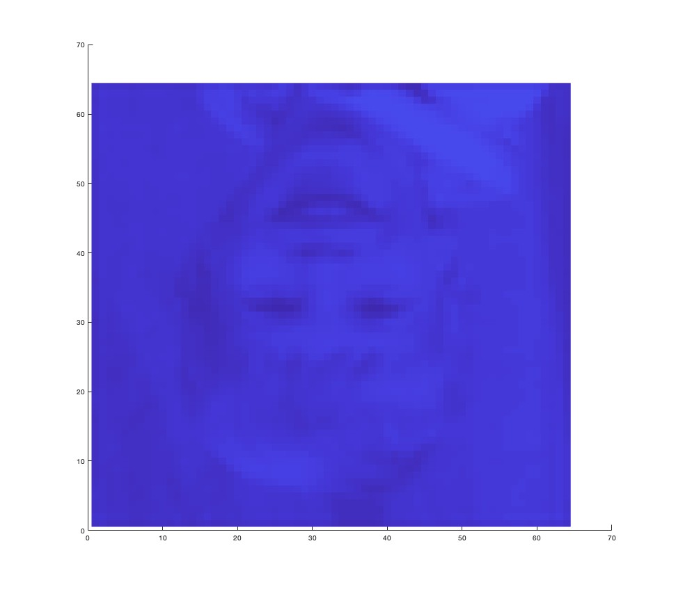

# Who is the child in this image?
How did he end up here? Does he truly exist, or is it something else entirely?

On October 30th, 2025, at midnight, I embarked on an experiment to manipulate the phase properties of an image’s spectrum. I converted the spatial-domain image to the frequency-domain and distorted specific properties of the spectrum, particularly the phase. Then, I transformed the manipulated spectrum back into the normal space-time dimension.

Typically, the output from previous manipulations of properties in other dimensions results in a completely new image, devoid of any interpretable shape. The entropy is significantly increased, leaving almost no trace of the original.

Imagine a raw egg dropped on the road and then run over by a car. The purpose of this experiment was to “attempt to restore the messy raw egg back to its original state.” Sounds almost impossible, right? But it’s possible! This is the extraordinary and out-of-this-world nature of this research (and I’m also losing my mind).

It was past midnight, and I was conducting the experiment described above using exponential linear factors to analyze trends in specific values and their relationships.

Of course, every time I write a program or run it, errors can occur and automatically halt the program, especially in interpreter languages like Python and MATLAB, which I’m implementing. Any output or visualization will simply freeze.

However, this error was unlike any other I’ve ever encountered in my life!

Despite the console output providing a simple error message—that the number or format of the input or output for the Absolute function was incorrect—the resulting visualization sent shivers down my spine!

It resembled an upside-down image of a smiling boy, just like the one you’re seeing here.

I was taken aback and momentarily stunned as my mind raced to find theories and equations to explain this phenomenon. A sense of dizziness washed over me, as if my brain was struggling to articulate the experience for those precious seconds.

It was as if I were sitting in my car, seemingly stationary in a parking lot, yet my right foot was slamming on the brakes. I felt as though my car was rolling backward, despite my efforts to press the brakes harder. The car continued to roll, causing me to feel dizzy, nauseous, and disoriented as my brain and body’s automatic responses clashed. It took me a while to overcome this moment and realize that my car wasn’t rolling; instead, the car next to me was slowly moving forward out of the parking space.

This feeling was eerily similar to what I experienced within myself.

What makes this coincidence or phenomenon so perplexing is that:
- It has no connection to AI, particularly neural networks, convolutional neural networks (CNNs), deep learning (DL), large language models (LLMs), generative adversarial networks (GANs), or any form of data generation.
- There’s virtually no randomness involved; it’s simply a transformation and manipulation of certain features in other dimensions.
- Any perceived loss or randomness is merely a result of floating-point reduction, discretization, or the Fast Fourier Transform.
- Regardless of how many times this incomplete code is executed, the output consistently produces the same child’s face.

When I examine this image again and attempt to rotate it 180 degrees to make it vertical, I gain a more intuitive understanding of it, as illustrated. It’s entirely different from the input image (a middle-aged Khon Kaen University professor in a formal suit - I’ll attach his image later if he permits). However, these input and output images appear to lack any explanation, theory, or definition of similarity or connection.

A myriad of conspiracy theories have begun to surface in my mind.

Is this a novel discovery?
Is it connected to a higher dimension?
Is it a conduit for interdimensional communication?
Are the dimensions interconnected? Time, past lives, opposites of physical characteristics, spirits, quantum mechanics, premonitions, and so on.

Or is it a mere coincidence, with a probability comparable to shooting an arrow on the moon and it landing on the tip of the Eiffel Tower?

If the facial expressions of the person in the input image changed in accordance with their posture, what would be the output for the child in this image?

Or… never mind, it’s just a coincidence…

**P.S.** The source code for this experiment may be disclosed when this research is published.
